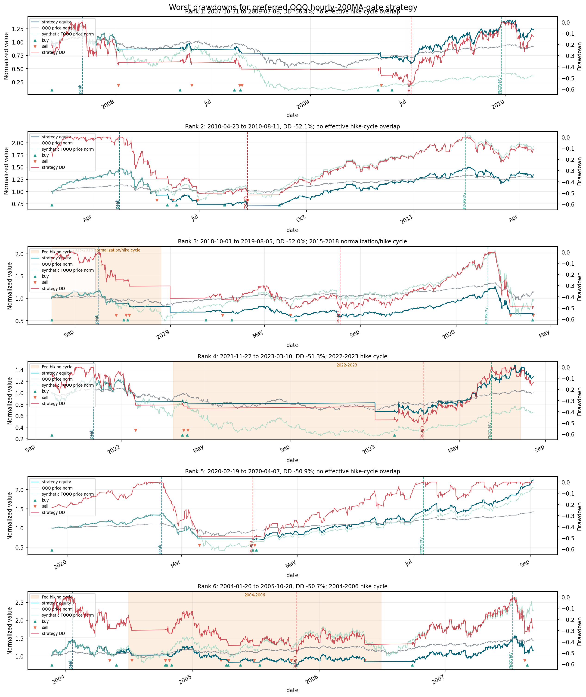

# QQQ / Synthetic-TQQQ Case Study

_Last updated: 2026-06-02_

This case study is the current flagship research application of the broader trend-following pipeline. The repo still contains a general ETF data/backtesting framework, but the deepest research thread now focuses on using **QQQ as the signal asset** and **synthetic +3x QQQ exposure** as the risk asset.

This is research-only documentation. It is not live trading advice.

## Research question

Can QQQ-based trend signals improve the drawdown profile of leveraged Nasdaq-100 exposure while keeping the strategy transparent, auditable, and practical to monitor manually?

The core idea is intentionally simple:

- Use the unlevered ETF **QQQ** for signal generation.
- Use a synthetic TQQQ-like return stream, `QQQ_3X_CALC`, for exposure.
- Focus on no-lookahead timing, transaction costs, slippage, taxes, cash yield, turnover, and large drawdowns.

## Why QQQ for signals?

QQQ is the unlevered Nasdaq-100 ETF. It is cleaner than TQQQ as a signal source because it is less path-dependent and less affected by leveraged ETF mechanics. The strategy therefore asks:

> If the underlying trend in QQQ is healthy, take leveraged QQQ exposure; if the underlying trend breaks, go to cash.

## Why synthetic TQQQ?

Synthetic TQQQ exposure is calculated from QQQ returns under a simplified daily-reset +3x assumption. This is useful because it gives a longer and cleaner research history than actual TQQQ alone.

Important limitation: synthetic TQQQ is not real TQQQ. Real TQQQ differs because of fees, financing, swap/futures implementation, daily rebalancing details, market impact, spreads, tracking error, and liquidity conditions.

## Current preferred strategy

The confirmed preferred rule is maintained in [`reports/preferred_strategy_rules.md`](../reports/preferred_strategy_rules.md). Summary:

- **Signal source:** QQQ.
- **Exposure:** synthetic TQQQ, `QQQ_3X_CALC`.
- **Entry trigger:** QQQ hourly MACD histogram > 0.
- **Entry gate:** QQQ hourly close > QQQ hourly 200-day moving average.
- **Exit rule:** QQQ hourly close < QQQ hourly 200-day moving average.
- **Daily regime gate:** removed.
- **Profit lock:** none.
- **Position size:** 100% target exposure when long.
- **Trading constraint:** max one trade per day.
- **Cash assumption:** out-of-market cash earns 3% annualized in evaluation.

Short label:

```text
new_candidate_no_daily_gate__qqq_hourly_200ma_entry_exit
```

## No-lookahead timing convention

Raw signals are timestamped when information becomes available at the close of a bar. The executable-position conversion shifts raw signals forward before returns are applied, so the strategy cannot earn the return from the same bar that generated the signal.

For the hourly strategy, the process is:

1. Compute QQQ indicators from completed hourly bars.
2. Generate raw desired exposure.
3. Shift into executable positions.
4. Enforce max one accepted position change per calendar day.
5. Apply synthetic TQQQ returns, transaction costs, slippage, tax approximation, and cash return.

## Latest comparison snapshot

Recent focused comparison with 3% annualized out-of-market cash return:

| Candidate | Annualized return | Sharpe | Max drawdown | Trades | Exposure | DD >20 / >30 / >40 / >50 |
|---|---:|---:|---:|---:|---:|---:|
| New preferred: no daily gate + QQQ hourly 200MA gate | 24.68% | 0.734 | -56.36% | 109 | 68.97% | 26 / 17 / 9 / 6 |
| Prior preferred: QQQ entry + QQQ exit + no lock | 23.37% | 0.721 | -58.19% | 101 | 64.92% | 21 / 14 / 7 / 5 |

Source table: [`reports/tables/tqqq_cash_yield_preferred_vs_hourly_200ma_candidate.csv`](../reports/tables/tqqq_cash_yield_preferred_vs_hourly_200ma_candidate.csv).

## Worst drawdowns and hiking-cycle context

The current preferred strategy's worst six drawdowns were compared with major Fed hiking-cycle windows.

| Rank | Peak | Trough | Recovery | Max DD | Hiking-cycle relationship |
|---:|---|---|---|---:|---|
| 1 | 2007-10-31 | 2009-07-08 | 2009-12-24 | -56.36% | No effective-cycle overlap |
| 2 | 2010-04-23 | 2010-08-11 | 2011-02-14 | -52.15% | No overlap |
| 3 | 2018-10-01 | 2019-08-05 | 2020-02-10 | -52.04% | Overlapped late 2015-2018 cycle; trough after cycle ended |
| 4 | 2021-11-22 | 2023-03-10 | 2023-06-15 | -51.33% | Overlapped 2022-2023 cycle; trough during cycle |
| 5 | 2020-02-19 | 2020-04-07 | 2020-07-06 | -50.86% | No overlap |
| 6 | 2004-01-20 | 2005-10-28 | 2007-07-12 | -50.73% | Overlapped 2004-2006 cycle; trough during cycle |

Summary: hiking cycles are important risk context, but they do not fully explain the largest drawdowns. Major non-hiking shocks such as the financial crisis and COVID crash also dominate the drawdown profile.



Detailed table: [`reports/tables/preferred_hourly_200ma_worst6_drawdowns_hiking_analysis.csv`](../reports/tables/preferred_hourly_200ma_worst6_drawdowns_hiking_analysis.csv).

## Reproduction commands

Assuming the required QQQ and synthetic TQQQ data caches already exist:

```bash
source ~/.venvs/myenv/bin/activate
python scripts/run_tqqq_cash_yield_candidate_comparison.py
python scripts/plot_preferred_worst_drawdowns_hiking.py
```

To recreate synthetic TQQQ from QQQ:

```bash
python scripts/create_synthetic_tqqq.py --intervals 1d 15min 30min 60min
```

## What was tried and not promoted

The research log in [`reports/project_log.md`](../reports/project_log.md) records both successful and unsuccessful experiments. Examples include:

- Daily QQQ regime gate variants.
- VIX percentile exit filters.
- Fed hiking-cycle switches.
- Profit-lock rules such as +150%, +200%, +250%, and +300% unrealized gain thresholds.
- TQQQ-sourced vs QQQ-sourced entry/exit signals.
- Gradual entry and tiered sizing.
- Moving-average derivative / multi-MA drawdown-warning filters.

This is intentional: the case study is presented as a research process, not as a cherry-picked final rule.

## Limitations

- Synthetic TQQQ is an approximation, not an actual executable product history.
- Tax treatment is simplified.
- Out-of-market cash return is modeled as a flat 3% annualized assumption.
- Hourly data quality depends on vendor coverage and adjustments.
- No live execution, order-book, market-impact, or broker-specific settlement model is included.
- Parameters were explored historically and may not generalize.
- This is not financial advice.

## Interview framing

A concise way to describe this case study:

> I built a general trend-following research pipeline first, then used it to conduct a focused QQQ/synthetic-TQQQ case study. The strategy uses QQQ for cleaner trend signals, synthetic +3x QQQ exposure for long-history leveraged analysis, explicit no-lookahead timing, transaction costs, tax/cash assumptions, and a documented research log of both failed and successful variants.
