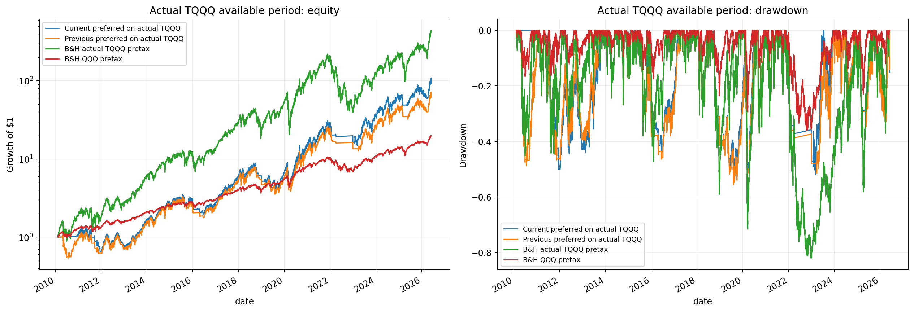

# QQQ / Synthetic-TQQQ Case Study

_Last updated: 2026-06-04_

This case study is the current flagship research application of the broader trend-following pipeline. The repo still contains a general ETF data/backtesting framework, but the deepest research thread now focuses on using **QQQ as the signal asset** and **synthetic +3x QQQ exposure** as the risk asset.

This is research-only documentation. It is not live trading advice.

## Research question

Can QQQ-based trend signals improve the drawdown profile of leveraged Nasdaq-100 exposure while keeping the strategy transparent, auditable, and practical to monitor manually?

The core idea is intentionally simple:

- Use the unlevered ETF **QQQ** for signal generation.
- Use a synthetic TQQQ-like return stream, `QQQ_3X_CALC`, for exposure.
- Focus on no-lookahead timing, transaction costs, slippage, taxes, cash yield, turnover, and large drawdowns.

## Why QQQ for signals?

QQQ is the unlevered Nasdaq-100 ETF. It is cleaner than TQQQ as a signal source because it is less path-dependent and less affected by leveraged ETF mechanics. The strategy therefore asks:

> If the underlying trend in QQQ is healthy, take leveraged QQQ exposure; if the underlying trend breaks, go to cash.

## Why synthetic TQQQ?

Synthetic TQQQ exposure is calculated from QQQ returns under a simplified daily-reset +3x assumption. This is useful because it gives a longer and cleaner research history than actual TQQQ alone.

Important limitation: synthetic TQQQ is not real TQQQ. Real TQQQ differs because of fees, financing, swap/futures implementation, daily rebalancing details, market impact, spreads, tracking error, and liquidity conditions.

## Date range convention

The default requested backtest start is now **1990-01-01**. For the QQQ/synthetic-TQQQ hourly case study, the effective start remains limited by available QQQ/proxy data. The current local Alpha Vantage 60-minute QQQ cache starts at **2000-01-03 10:00**, and the first executable long entry in the latest preferred-strategy table is **2002-01-10 15:00** after indicator warmup and entry conditions.

Extending the actual QQQ-like research history to 1990 will use Nasdaq-100 index data as a documented pre-QQQ proxy where available. This is a proxy, not actual QQQ ETF data. The project policy is recorded in [`docs/pre_qqq_proxy.md`](pre_qqq_proxy.md).

## Current preferred strategy

The confirmed preferred rule is maintained in [`reports/preferred_strategy_rules.md`](../reports/preferred_strategy_rules.md). Summary:

- **Signal source:** QQQ.
- **Exposure:** synthetic TQQQ, `QQQ_3X_CALC`.
- **Entry trigger:** QQQ hourly MACD histogram > 0.
- **Entry gate:** QQQ hourly close > QQQ hourly 200-day moving average.
- **Exit rule:** QQQ hourly close < QQQ hourly 200-day moving average.
- **Daily regime gate:** removed.
- **Profit lock:** +300% unrealized synthetic-TQQQ trade gain -> 75%; +400% -> 50%.
- **Dynamic q100 trim:** after +110% trade gain, learn the max QQQ distance above its hourly 200MA up to that point; later trim to 50% if QQQ revisits/exceeds it, and re-add on a QQQ 20MA pullback.
- **Best robustness bear filter:** when QQQ's hourly 200MA slope is negative, a new entry also requires QQQ to be at least 1% above the 200MA, QQQ 50MA slope over 30 trading days to be positive, and QQQ 20MA > QQQ 50MA.
- **Trade-peak stop:** exit if synthetic TQQQ falls 40% from its current trade peak.
- **Position size:** 100% target exposure on entry; can reduce to 75% or 50% after profit-lock/dynamic-trim overlays.
- **Trading constraint:** max one trade per day.
- **Cash assumption:** out-of-market cash earns 3% annualized in evaluation.

Short label:

```text
preferred_qqq_hourly_200ma_macd_profit_lock_300_400_stop40_q110_best_bear_filter
```

## No-lookahead timing convention

Raw signals are timestamped when information becomes available at the close of a bar. The executable-position conversion shifts raw signals forward before returns are applied, so the strategy cannot earn the return from the same bar that generated the signal.

For the hourly strategy, the process is:

1. Compute QQQ indicators from completed hourly bars.
2. Generate raw desired exposure.
3. Shift into executable positions.
4. Enforce max one accepted position change per calendar day.
5. Apply synthetic TQQQ returns, transaction costs, slippage, tax approximation, and cash return.

## Latest performance snapshot

The repository now keeps the current preferred rule plus two retained alternative candidates in GitHub. All rows below use the same evaluation convention unless otherwise noted: after-tax approximation, 1 bp transaction cost, 5 bps slippage, and 3% annualized return on out-of-market cash.

### Long-history synthetic +3x QQQ test

This is the main long-history research comparison using `QQQ_3X_CALC` as the target return series.

| Candidate | Annualized return | Sharpe | Max drawdown | Trades | Approx. trades/year | Exposure | DD >20 / >30 / >40 / >50 |
|---|---:|---:|---:|---:|---:|---:|---:|
| Prior current preferred: 12/26/9 MACD + QQQ hourly 200MA gate +300/+400 lock + q110 q100 trim + best robustness bear filter + 40% peak stop | 29.41% | 0.857 | -52.15% | 128 | 4.86 | 63.09% | 23 / 8 / 5 / 3 |
| **Updated preferred MACD option: 12/24/9 (`macd_slow_24d`) in the same rule stack** | **32.62%** | **0.897** | -52.79% | 124 | 5.10 | 68.58% | 22 / 7 / 4 / 2 |
| Candidate A: QQQ entry + TQQQ/synthetic exit + 200/300 profit lock | 23.57% | **0.753** | **-48.83%** | 184 | 6.97 | 59.75% | 22 / 10 / 4 / 0 |
| Candidate B: TQQQ/synthetic entry + TQQQ/synthetic exit + 200/300 profit lock | 23.50% | 0.751 | **-48.83%** | 188 | 7.12 | 60.02% | 20 / 9 / 3 / 0 |

Source tables:

- [`reports/tables/qqq_tqqq_retained_candidate_performance_synthetic.csv`](../reports/tables/qqq_tqqq_retained_candidate_performance_synthetic.csv)
- [`reports/tables/preferred_profit_lock_stop_exit_comparison_compact.csv`](../reports/tables/preferred_profit_lock_stop_exit_comparison_compact.csv)
- [`reports/tables/tqqq_cash_yield_candidate_comparison_compact.csv`](../reports/tables/tqqq_cash_yield_candidate_comparison_compact.csv)
- [`reports/tables/preferred_q100_activation_sweep_2010plus.csv`](../reports/tables/preferred_q100_activation_sweep_2010plus.csv)
- [`reports/tables/bear_filter_variant_experiments_compact.csv`](../reports/tables/bear_filter_variant_experiments_compact.csv)

Interpretation: the updated q110 + best robustness bear-filter rule has the highest annualized return among these retained candidates, while preserving moderate turnover. The two mixed-source alternatives have lower drawdowns, but require substantially more trades and lower return.


### Promoted candidate: best robustness bear re-entry filter

The previous serious bear-filter candidate has now been promoted into the preferred rule, but using the more robust 30-day slope variant rather than the initial 20-day version.

The promoted variant is `robust_buf010bp_slope30_20gt50` with q100 activation moved from +100% to +110%. It improved the long-history synthetic test to 29.41% annualized return with 0.857 Sharpe, reduced max drawdown from -56.36% to -52.15%, and reduced approximate trades/year from 5.70 to 4.86. See [`reports/serious_candidates.md`](../reports/serious_candidates.md) for the older candidate history.

### Actual TQQQ available-history sanity check

This older sanity check applied previous QQQ-signal rules to **actual TQQQ** hourly returns over actual TQQQ's available Alpha Vantage 60-minute history. It has not yet been refreshed for the newly promoted q110 + best robustness bear-filter preferred rule.

| Candidate | Annualized return | Sharpe | Max drawdown | Trades | Approx. trades/year | Exposure | DD >20 / >30 / >40 / >50 |
|---|---:|---:|---:|---:|---:|---:|---:|
| Previous preferred: QQQ hourly 200MA gate, no daily gate, no lock | **32.07%** | **0.853** | -53.34% | **61** | **3.74** | 78.85% | 18 / 13 / 5 / 4 |
| Candidate A: QQQ entry + TQQQ/synthetic exit + 200/300 profit lock | 23.28% | 0.716 | **-48.83%** | 157 | 9.63 | 73.10% | 16 / 10 / 5 / 0 |
| Candidate B: TQQQ/synthetic entry + TQQQ/synthetic exit + 200/300 profit lock | 23.10% | 0.712 | -49.50% | 161 | 9.88 | 73.27% | 16 / 10 / 5 / 0 |

Source tables:

- [`reports/tables/qqq_tqqq_retained_candidate_performance_actual_tqqq.csv`](../reports/tables/qqq_tqqq_retained_candidate_performance_actual_tqqq.csv)
- [`reports/tables/actual_tqqq_current_previous_preferred_summary.csv`](../reports/tables/actual_tqqq_current_previous_preferred_summary.csv)



Interpretation at the time of that older test: the prior preferred rule had the highest annualized return, highest Sharpe, and lowest trade count among the retained candidates, while the profit-lock candidates reduced maximum drawdown at the cost of many more trades and lower return. The actual-TQQQ check should be rerun after the new preferred rule is fully wired into the retained-candidate comparison script.


## Start-date and parameter robustness checks

The project now includes start-date and walk-forward cross-validation for the preferred QQQ/synthetic-TQQQ rule. These checks vary major parameters around the current preferred rule and compare performance from multiple official evaluation start dates, with QQQ buy-and-hold aligned to each same start.

Key outputs:

- [`reports/tables/preferred_start_date_cv_summary.csv`](../reports/tables/preferred_start_date_cv_summary.csv)
- [`reports/tables/preferred_parameter_robustness_rank.csv`](../reports/tables/preferred_parameter_robustness_rank.csv)
- [`reports/tables/preferred_walk_forward_cv.csv`](../reports/tables/preferred_walk_forward_cv.csv)
- [`reports/figures/preferred_start_date_cv_heatmap.png`](../reports/figures/preferred_start_date_cv_heatmap.png)
- [`reports/figures/preferred_walk_forward_cv_equity_drawdown.png`](../reports/figures/preferred_walk_forward_cv_equity_drawdown.png)

Current interpretation: the active preferred MACD option is now `macd_slow_24d` / 12-24-9, because it had the strongest official-start and robustness performance among the very close MACD variants. However, the 12-24-9, 12-26-9, and 12-26-8 choices remain documented together as near-equivalent MACD options; the differences are small enough that this may be overfit parameter noise rather than a robust edge.

## Worst drawdowns and hiking-cycle context

The current preferred strategy's worst six drawdowns were compared with major Fed hiking-cycle windows.

| Rank | Peak | Trough | Recovery | Max DD | Hiking-cycle relationship |
|---:|---|---|---|---:|---|
| 1 | 2007-10-31 | 2009-07-08 | 2009-12-24 | -56.36% | No effective-cycle overlap |
| 2 | 2010-04-23 | 2010-08-11 | 2011-02-14 | -52.15% | No overlap |
| 3 | 2018-10-01 | 2019-08-05 | 2020-02-10 | -52.04% | Overlapped late 2015-2018 cycle; trough after cycle ended |
| 4 | 2021-11-22 | 2023-03-10 | 2023-06-15 | -51.33% | Overlapped 2022-2023 cycle; trough during cycle |
| 5 | 2020-02-19 | 2020-04-07 | 2020-07-06 | -50.86% | No overlap |
| 6 | 2004-01-20 | 2005-10-28 | 2007-07-12 | -50.73% | Overlapped 2004-2006 cycle; trough during cycle |

Summary: hiking cycles are important risk context, but they do not fully explain the largest drawdowns. Major non-hiking shocks such as the financial crisis and COVID crash also dominate the drawdown profile.


Detailed table: [`reports/tables/preferred_hourly_200ma_worst6_drawdowns_hiking_analysis.csv`](../reports/tables/preferred_hourly_200ma_worst6_drawdowns_hiking_analysis.csv).

## Reproduction commands

Assuming the required QQQ and synthetic TQQQ data caches already exist:

```bash
source ~/.venvs/myenv/bin/activate
python scripts/run_tqqq_cash_yield_candidate_comparison.py
python scripts/plot_preferred_worst_drawdowns_hiking.py
```

To recreate synthetic TQQQ from QQQ:

```bash
python scripts/create_synthetic_tqqq.py --intervals 1d 15min 30min 60min
```

## What was tried and not promoted

The research log in [`reports/project_log.md`](../reports/project_log.md) records both successful and unsuccessful experiments. Examples include:

- Daily QQQ regime gate variants.
- VIX percentile exit filters.
- Fed hiking-cycle switches.
- Profit-lock rules such as +150%, +200%, +250%, and +300% unrealized gain thresholds.
- TQQQ-sourced vs QQQ-sourced entry/exit signals.
- Gradual entry and tiered sizing.
- Moving-average derivative / multi-MA drawdown-warning filters.

This is intentional: the case study is presented as a research process, not as a cherry-picked final rule.

## Limitations

- Synthetic TQQQ is an approximation, not an actual executable product history.
- Tax treatment is simplified.
- Out-of-market cash return is modeled as a flat 3% annualized assumption.
- Hourly data quality depends on vendor coverage and adjustments.
- No live execution, order-book, market-impact, or broker-specific settlement model is included.
- Parameters were explored historically and may not generalize.
- This is not financial advice.

## Interview framing

A concise way to describe this case study:

> I built a general trend-following research pipeline first, then used it to conduct a focused QQQ/synthetic-TQQQ case study. The strategy uses QQQ for cleaner trend signals, synthetic +3x QQQ exposure for long-history leveraged analysis, explicit no-lookahead timing, transaction costs, tax/cash assumptions, and a documented research log of both failed and successful variants.
