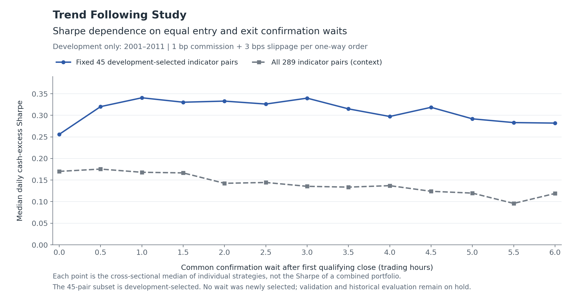
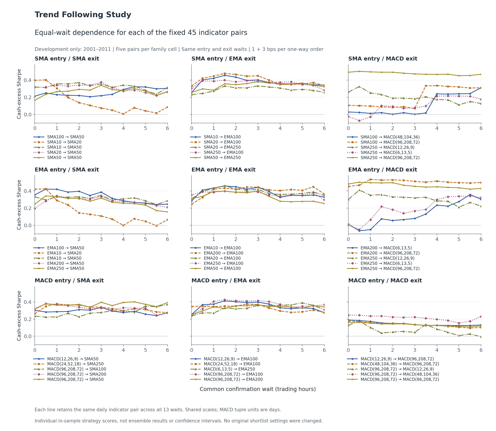

# Trend Following Study — Equal Entry/Exit Wait Sensitivity

**Development only: January 2, 2001–December 30, 2011; 2,767 daily valuation sessions.**
This diagnostic holds each indicator pair fixed and sets **entry wait = exit wait**
to 0, 0.5, 1, …, 6 trading hours. It uses the already completed development
sweep; **no market backtest was rerun, no original shortlist setting was changed,
and no new best wait or strategy was selected.** Validation and historical
numerical inspection/evaluation remain on hold.

## Does the wait matter?

**Yes for individual configurations, but longer is not consistently better.**
For the fixed 45 development-selected indicator pairs, the median within-pair
highest-minus-lowest Sharpe across the 13 waits is **0.147** (middle half:
**0.103–0.186**); **35 of 45 pairs** vary by more than 0.10. Yet changing
both waits from 0 to 6 hours improves only **23 pairs** and worsens **22**.
The median paired Sharpe change is only **+0.006**.

Waiting also substantially reduces trading: the median development round-trip
count falls from **134 at 0 hours to 38 at 6 hours**. Across these 45 individual
strategies, aggregate round trips fall from **6,433 to 1,934 (69.94% fewer)**.
This descriptive sum is not a portfolio trading result. Lower turnover does not
by itself imply higher risk-adjusted returns: confirmation can filter brief
signals but can also postpone entries/exits. Those are possible mechanisms,
not a causal attribution established by this table.

## Exact cross-sectional dependence

The **primary cohort** is the 45 distinct indicator pairs already frozen using
2001–2011 development results: five pairs per entry/exit family cell. Their
original asymmetric waits are ignored only for this matched sensitivity
comparison, not rewritten. Every pair is present at every common wait:
**45 × 13 = 585 configurations**.

The context cohort contains **all 17 × 17 = 289 indicator pairs**, with the same
13 common waits: **3,757 configurations**. It contains the 45-pair subset, so
these are overlapping populations, not independent samples. Family composition
also differs: the 45-pair subset has five pairs per family cell, while the full
universe has 25–36 pairs per cell.

**Sharpe below is an individual strategy score summarized across pairs; it is
not the Sharpe of a combined or equally weighted portfolio.** Means and medians
have no ensemble-return interpretation.

| Common entry/exit wait (h) | Consecutive checks | Fixed 45: median Sharpe | Fixed 45: mean Sharpe | Fixed 45: median round trips | All 289: median Sharpe | All 289: mean Sharpe |
|---:|---:|---:|---:|---:|---:|---:|
| 0 | 1 | 0.256 | 0.258 | 134 | 0.170 | 0.139 |
| 0.5 | 2 | 0.320 | 0.293 | 87 | 0.175 | 0.150 |
| 1 | 3 | 0.341 | 0.300 | 68 | 0.168 | 0.140 |
| 1.5 | 4 | 0.330 | 0.310 | 59 | 0.167 | 0.141 |
| 2 | 5 | 0.333 | 0.300 | 54 | 0.143 | 0.129 |
| 2.5 | 6 | 0.326 | 0.292 | 49 | 0.144 | 0.126 |
| 3 | 7 | 0.340 | 0.300 | 48 | 0.136 | 0.126 |
| 3.5 | 8 | 0.315 | 0.288 | 46 | 0.134 | 0.113 |
| 4 | 9 | 0.297 | 0.287 | 44 | 0.137 | 0.106 |
| 4.5 | 10 | 0.319 | 0.290 | 43 | 0.124 | 0.100 |
| 5 | 11 | 0.292 | 0.281 | 41 | 0.120 | 0.099 |
| 5.5 | 12 | 0.283 | 0.274 | 40 | 0.096 | 0.094 |
| 6 | 13 | 0.282 | 0.272 | 38 | 0.119 | 0.097 |

At 6 versus 0 hours, the **difference between the fixed-cohort medians** is
0.282 − 0.256 = **+0.026**. That is **not** the median of individual paired
changes (**+0.006**). The paired analysis subtracts each pair's own 0-hour
Sharpe first, then summarizes those changes. Its mean paired change is **+0.014**,
with individual changes ranging from **−0.354 to +0.318**.

Across all 289 pairs, 6-hour versus 0-hour confirmation improves **112** and
worsens **177**; mean Sharpe falls from **0.139 to 0.097**, and median Sharpe
falls from **0.170 to 0.119**. The median within-pair span is **0.155**.
This broader result is context, not evidence that a particular wait is optimal.

## Individual pair curves

Each family cell below contains its five unchanged development-selected daily
indicator pairs. Every line is shown at all 13 equal waits on the same scales;
none was dropped because its Sharpe worsened.

## What a confirmation wait means

- Indicators retain **daily-session lookbacks**, not hourly lookbacks. Provisional
  EMA/MACD values start from the previous finalized daily state; they do not
  recursively advance at every half-hour check.
- For common wait `h`, required qualifying completed half-hour observations are
  `1 + 2h`. **0 hours means one qualifying close; 0.5 means two; 6 means thirteen.**
  It is consecutive confirmation, **not** an unconditional order delay.
- While flat, entry requires entry-side and exit-side support to hold together
  throughout the entry confirmation streak. While long, exit confirms consecutive
  failures of exit-side support. Interruptions reset the relevant streak.
- Streaks carry across normal overnight, weekend and holiday closures; these
  closures do not add trading hours. Counters reset after fills and at research
  boundaries. The subsequent safe observed half-hour open is used for fills,
  never the signal bar's preceding open or a missing bar's invented price.
- The original 6.5-hour setting remains in the frozen study but is **excluded
  from this 0–6-hour diagnostic**, matching the user-requested range.

## Accounting, gaps and limitations

All figures use **1 bp commission + 3 bps adverse slippage per one-way order**,
100% unlevered QQQ or cash, and the existing corporate-action, cash-accrual,
terminal-liquidation and 17:00 New York daily-valuation conventions. There are
no tax, synthetic-financing or separate fund-expense charges. Cash-excess
Sharpe uses daily session-close portfolio returns minus the causal cash proxy,
√252 annualization and sample standard deviation (`ddof=1`).

The 14 missing development half-hours remain disclosed: the March 29, 2001
opening half-hour and all 13 half-hours on November 30, 2004. The last filled
position is carried through missing intervals without invented prices or fills;
pending orders are cancelled and confirmation streaks reset. Existing
post-gap flags remain in the per-pair export. **Flags never filter, rank or
replace a pair.** This summary does not demonstrate gap insensitivity.

The 45 pairs were chosen on the same development history using separately
optimized original entry/exit waits. Their equal-wait dependence is therefore
**in-sample and selection-biased**, not independent evidence of robustness.
The all-pair context does not remove that bias or establish future performance.
No significance tests or confidence intervals are claimed. Previously examined
later history cannot be made genuinely untouched; this diagnostic opens no
later-period numerical outcomes and does not lift the operational hold.

Underlying intraday prices are verified reconstructed as-traded Alpha values,
not guaranteed native raw captures or certified point-in-time vendor history.
The cash proxy is latest-vintage FRED DTB3 with modeled causal release lags,
not a traded bill return series. Slippage is hypothetical, not measured execution
costs. These inherited assumptions remain unchanged.

## Inspectable evidence and reproduction

- [Per-wait summaries](per_wait_summary.csv): all 13 waits, both fixed cohorts,
  finite-score counts, means/medians/quartiles, turnover and paired changes.
- [All 3,757 matched configurations](per_pair_equal_wait_metrics.csv): individual
  development metrics, unchanged indicator identities and descriptive gap flags.
- [Individual paired changes versus 0 hours](paired_changes_vs_zero.csv).
- [Per-pair spans across all 13 waits](per_pair_wait_range.csv).
- [Family-cell summaries](family_wait_summary.csv).
- [Scope and input hashes](summary.json).
- [Independent arithmetic/input audit](independent_audit.json).
- [Artifact integrity hashes](artifact_hashes.json).
- [Unchanged development-only shortlist](../../development_shortlist_hold/20261008/README.md).

From the repository root, regenerate derived tables into a **new, nonexistent**
output directory with `~/.venvs/myenv/bin/python scripts/summarize_equal_waits.py
--output <new-directory>`. This command validates pinned development inputs and
frozen sources; it does not invoke a market simulation or open later outcomes.
The saved static figures plot those exported tables. Public evidence contains
no downloaded/raw prices, trade ledger, credentials or private freezes.
