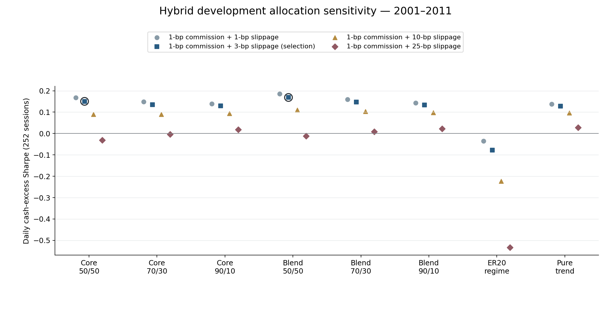
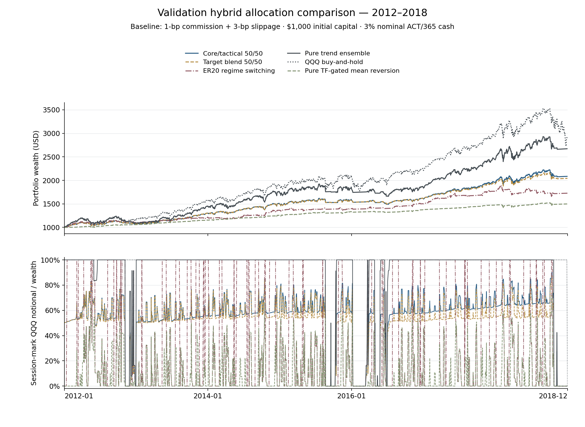
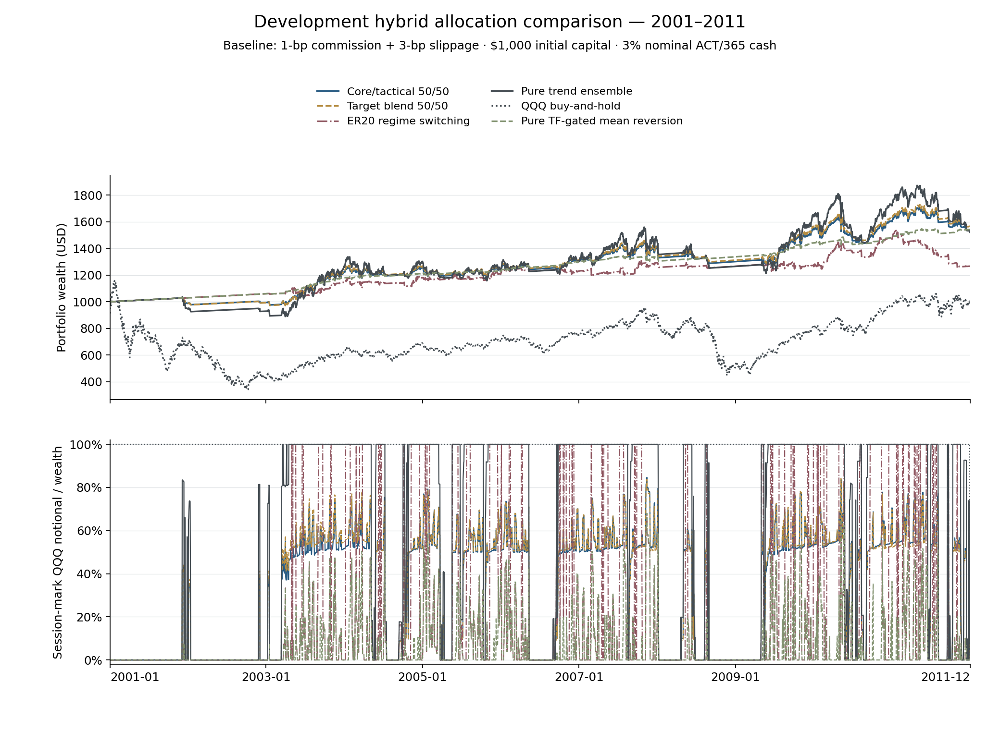

# Trend Following Study — Trend Core, Tactical Mean Reversion and Adaptive Allocation

Compare **A: fixed-capital core/tactical sleeves**, **B: actual partial-position target blending**, and **C: confirmed ER20 regime switching**. All 12 unchanged trend rules × all 32 unchanged mean-reversion rules form **384 equal-initial-capital pairs**; no pair is selected or removed.

**Retrospective and hindsight-conditioned:** the twelve trend rules were chosen using 2012–2018 validation performance. New development selection does not restore independent confirmation. **2019 onward remains closed.**

## Results in plain language

- Development locked **50/50** for both A and B; no allocation changed after validation. The ER20 regime rule was fixed before performance calculations.
- In retrospective validation at baseline costs, core/tactical A scored **0.8927** versus pure trend **0.8979**. Blending B scored **0.9080**, an advantage of only **0.0101**. Regime switching scored **0.6848**, below pure trend, buy-and-hold and the pure gated-MR control.
- Blending's small Sharpe difference came with materially lower growth: **10.75% CAGR versus 15.08%**, daily drawdown **-7.45% versus -13.70%**, and exposure **51.3% versus 88.9%**. This comparison does not separately identify timing alpha from the effect of lower market exposure.
- Blending also traded more: portfolio-notional turnover **7.32×/year versus 3.43×**, with **117.6 versus 9.1 distinct execution timestamps/year**. Funded logical sleeve orders are reported separately; no cross-account netting is assumed.
- The 20-session-block 95% bootstrap interval for B minus pure-trend Sharpe is **[-0.1029, 0.1235]**. All 27 predefined bootstrap intervals include zero: these comparisons do not establish an improvement and cannot remove historical selection bias.
- B's small baseline advantage reverses under the 10/25-bp slippage scenarios. At 10 bps, its Sharpe is **0.8474 versus 0.8792** for pure trend; at 25 bps, **0.7227 versus 0.8392**. There is no cost-specific reselection.

**Conclusion:** this experiment found no clear, cost-robust Sharpe improvement over pure trend. Core/tactical and blending substantially reduce exposure and drawdown, but sacrifice growth and increase trading; the fixed regime selector performed worse. These are historical research findings, not evidence of live effectiveness.

## Development selections — 2001–2011

Frozen baseline selections: A: **Core/tactical 50/50**; B: **Target blend 50/50**. The ER20 regime route is fixed, not performance-selected. A and B independently maximize daily cash-excess Sharpe after 1-bp commission + 3-bps slippage; undefined scores are excluded, ties within 1e-10 use stable portfolio ID. No pair, trade-frequency, return, drawdown or beat-BH filter applies.

Both selected allocations are retained unchanged at every validation cost.

| Portfolio | Cash-excess Sharpe | CAGR | Daily drawdown loss | Exposure | Actual sleeve orders/year | Notional turnover/year |
|---|---:|---:|---:|---:|---:|---:|
| Core/tactical 50/50 | 0.1504 | 3.96% | 12.06% | 32.55% | 2868.3093 | 6.8805 |
| Core/tactical 70/30 | 0.1352 | 3.93% | 16.12% | 42.87% | 2868.3093 | 6.5773 |
| Core/tactical 90/10 | 0.1293 | 3.91% | 20.27% | 53.02% | 2868.3093 | 6.3030 |
| Target blend 50/50 | 0.1686 | 4.12% | 11.87% | 32.91% | 4930.5715 | 6.8363 |
| Target blend 70/30 | 0.1473 | 4.06% | 16.09% | 43.16% | 4930.5715 | 6.5439 |
| Target blend 90/10 | 0.1336 | 3.96% | 20.26% | 53.14% | 4930.5715 | 6.2901 |
| ER20 regime switching | -0.0770 | 2.17% | 18.86% | 22.59% | 5899.5557 | 15.5187 |
| Pure trend ensemble | 0.1285 | 3.89% | 22.25% | 58.03% | 74.5582 | 6.1763 |

Rings mark the A/B baseline selections, deduplicating a shared pure-trend fallback. Other cost scenarios never reselect weights or rules.

## Retrospective validation — 2012–2018

All eight principal portfolios are predefined: three A weights (50/70/90% core), three B weights, fixed C, and shared pure-trend fallback. Nonselected allocations remain controls—not replacement winners.

| Portfolio | Cash-excess Sharpe | CAGR | Daily drawdown loss | Exposure | Actual sleeve orders/year | Notional turnover/year |
|---|---:|---:|---:|---:|---:|---:|
| Core/tactical 50/50 | 0.8927 | 11.08% | 7.98% | 54.93% | 4122.5379 | 6.9931 |
| Core/tactical 70/30 | 0.8946 | 12.78% | 10.43% | 69.57% | 4122.5379 | 5.4448 |
| Core/tactical 90/10 | 0.8967 | 14.35% | 12.68% | 82.76% | 4122.5379 | 4.0645 |
| Target blend 50/50 | 0.9080 | 10.75% | 7.45% | 51.27% | 5253.4136 | 7.3152 |
| Target blend 70/30 | 0.9040 | 12.53% | 9.78% | 66.78% | 5253.4136 | 5.6844 |
| Target blend 90/10 | 0.8997 | 14.25% | 12.43% | 81.67% | 5253.4136 | 4.1561 |
| ER20 regime switching | 0.6848 | 8.12% | 12.29% | 36.95% | 7071.3313 | 18.9876 |
| Pure trend ensemble | 0.8979 | 15.08% | 13.70% | 88.90% | 41.1539 | 3.4276 |

### Cost-matched controls

| Portfolio | Cash-excess Sharpe | CAGR | Daily drawdown loss | Exposure | Actual sleeve orders/year | Notional turnover/year |
|---|---:|---:|---:|---:|---:|---:|
| Independent sleeves 50/50 | 0.8994 | 11.27% | 8.29% | 55.97% | 432.9736 | 7.8264 |
| Independent sleeves 70/30 | 0.9019 | 12.89% | 10.07% | 70.08% | 432.9736 | 5.9266 |
| Independent sleeves 90/10 | 0.8994 | 14.38% | 12.46% | 82.90% | 432.9736 | 4.2196 |
| Pure trend ensemble | 0.8979 | 15.08% | 13.70% | 88.90% | 41.1539 | 3.4276 |
| Ungated mean-reversion ensemble | 0.5992 | 6.46% | 7.55% | 12.93% | 391.8197 | 13.7625 |
| QQQ buy-and-hold | 0.8562 | 16.59% | 22.79% | 100.00% | — | 0.2857 |
| Cash | — | 3.05% | 0.00% | 0.00% | — | 0.0000 |
| Pure TF-gated mean reversion | 0.7587 | 5.95% | 4.07% | 9.31% | 4081.3839 | 11.9235 |

The independent 50/70/90% controls are **ungated fixed-capital sleeves**, not A's TF-state-gated tactical allocation. Pure trend is shared with the fallback; gated MR is a separate control, not a second invested trend core.

### Locked A/B and fixed C under hypothetical execution stress

| Portfolio | Slippage + 1-bp commission | Cash-excess Sharpe | CAGR | Daily drawdown loss | Exposure | Actual sleeve orders/year | Notional turnover/year |
|---|---:|---:|---:|---:|---:|---:|---:|
| Core/tactical 50/50 | 1 + 1 bp | 0.9087 | 11.23% | 7.98% | 54.85% | 4122.5379 | 7.0586 |
| Target blend 50/50 | 1 + 1 bp | 0.9256 | 10.91% | 7.45% | 51.28% | 5253.4136 | 7.3461 |
| ER20 regime switching | 1 + 1 bp | 0.7358 | 8.54% | 12.06% | 36.98% | 7071.3313 | 19.0287 |
| Core/tactical 50/50 | 3 + 1 bp | 0.8927 | 11.08% | 7.98% | 54.93% | 4122.5379 | 6.9931 |
| Target blend 50/50 | 3 + 1 bp | 0.9080 | 10.75% | 7.45% | 51.27% | 5253.4136 | 7.3152 |
| ER20 regime switching | 3 + 1 bp | 0.6848 | 8.12% | 12.29% | 36.95% | 7071.3313 | 18.9876 |
| Core/tactical 50/50 | 10 + 1 bp | 0.8391 | 10.57% | 8.67% | 55.20% | 4122.5379 | 6.7737 |
| Target blend 50/50 | 10 + 1 bp | 0.8474 | 10.18% | 7.73% | 51.22% | 5253.4136 | 7.2085 |
| ER20 regime switching | 10 + 1 bp | 0.5066 | 6.69% | 13.11% | 36.81% | 7071.3313 | 18.8455 |
| Core/tactical 50/50 | 25 + 1 bp | 0.7350 | 9.60% | 10.37% | 55.70% | 4122.5379 | 6.3511 |
| Target blend 50/50 | 25 + 1 bp | 0.7227 | 9.04% | 9.24% | 51.13% | 5253.4136 | 6.9870 |
| ER20 regime switching | 25 + 1 bp | 0.1297 | 3.75% | 14.77% | 36.53% | 7071.3313 | 18.5506 |

[Paired bootstrap intervals](validation_bootstrap.csv) use 2,000 paired circular moving-block resamples, blocks of 5/20/60 sessions, seed 20261009, and 95% percentile intervals. Locked A compares with TF, BH and matching-weight independent sleeves; locked B compares with TF, BH and matching-weight A; fixed C compares with TF, BH and pure TF-gated MR. Identical subject-and-reference return-path comparisons are deduplicated while architecture/subject/reference aliases remain visible. These intervals do **not** correct historical member-selection bias.

## Architecture and causal execution definitions

- **A:** fund twelve unchanged TF core accounts at a/12 and 384 stateful tactical accounts at (1−a)/384. Each tactical MR may enter and re-enter only while its paired TF filled state is long. A confirmed TF exit cancels tactical buys and forces tactical sales at the same next safe open, without another MR wait. A recovery exit never sells the core. Cash and gains stay in their funded sleeve; weights drift.
- **B:** fund 384 pair accounts equally. Target QQQ fraction is a×sTF+(1−a)×sMR,gated: zero with TF cash, a with TF long/MR cash, one with both long. Trade only when confirmed state changes alter the target—not to maintain weights after price drift. Desired fractions apply to post-cost equity at the raw execution open. Actual partial fills incur commission/slippage once; simultaneous target changes produce one pair order. This is not a weighted average of independently compounded curves.
- **C:** daily ER20 is |S(t)−S(t−20)| divided by the sum of twenty absolute daily changes, using 21 consecutive finalized causal signal-index values. The ratio follows the general efficiency-ratio form documented in [StockCharts ChartSchool](https://chartschool.stockcharts.com/table-of-contents/technical-indicators-and-overlays/technical-overlays/kaufmans-adaptive-moving-average-kama); its example uses ten periods. This study fixes twenty daily sessions and 0.25/0.35 routing thresholds as research choices, not recommended or validated StockCharts settings. A zero denominator is valid ER=0 by this study's convention; incomplete/nonfinite required observations are UNKNOWN. ER is available at assumed 17:00 New York, never an intraday preview. Start each segment in TF mode; seven completed half-hour checks with ER≤0.25 confirm MR mode, or ER≥0.35 confirm TF mode. Neutral observations reset the switch streak but retain the mode.
- Both models run warm within TF permission. Routing handoffs adopt the incoming model's already confirmed filled/projected state; no extra fresh-entry wait, counter reset or fictional sell/rebuy when the target agrees. Warm routing never activates MR history from a closed TF permission window. An invalidated daily switch trigger cancels a pending mode change without counting a new check. UNKNOWN ER affects only C: retain mode, cancel/reset switches, suppress risk increases but allow valid risk reductions; reconcile the current confirmed target at the next safe open when ER becomes valid.
- Atomic open ordering is cash accrual/actions/DRIP, snapshot prior-close intents, project TF first, cancel MR buys/force tactical exit if TF exits, project MR/mode, then place each actual account order once. Signal decisions never use that execution open. New gated MR starts fresh after TF entry; its first eligible check is the newly filled bar's completed close. Closing half-hours, early closes and normal overnight streak carry are retained.
- Missing/unsafe intervals hold the last filled position, cancel pending orders and reset confirmation streaks. Segment boundaries reset positions/orders/counters; prior data initialize daily features only. Post-gap flags through the next trading session's close are descriptive and never rank or filter pairs.
- Cancellation counts are pending-intent diagnostics, not claims of real broker order cancellations. A and pure controls count funded sleeve intents: twelve TF cores only once, plus funded tactical intents where applicable. B/C count the shared TF and warm gated-MR model intents, including inactive routing models—not canceled actual broker orders. Executed sleeve orders and regime-switch cancellations are reported separately.

## Accounting, metrics and interpretation limits

- Start each segment at $1,000; fractional QQQ/cash only, no leverage/shorts/taxes/financing/separate fund expense. Cash accrues 3% nominal ACT/365 on the observed event clock—not exactly 3% APY. Preserve split/dividend/DRIP and terminal-close liquidation with cash accrual to 17:00 conventions.
- Aggregate actual funded account wealth, then recompute returns and Sharpe; no cross-account netting, cash redistribution or implicit portfolio-level rebalancing. A core orders count twelve funded accounts, not 384 repeated pair attributions. Pair outcome/holding diagnostics do not become additional funded orders.
- Daily cash-excess Sharpe uses sqrt(252) and sample standard deviation; CAGR uses actual calendar years. Daily drawdown uses provider marks at assumed 17:00 NY, not intraday lows. Exposure is actual QQQ notional/wealth on the event-left calendar-time ledger; the charts show session-mark exposure. Gross actual sleeve orders, distinct execution timestamps, portfolio-notional turnover and flat-to-flat/tactical holding durations are separate measures—not summed net portfolio round trips.
- A's initial/ending style weights refer to funded capital. B/C funded ending style-wealth weights are explicitly **N/A**; their fixed signal coefficients, exposure contributions, mode occupancy and ending mode are routing diagnostics, **not separately funded sleeve weights**. Terminal liquidation can make final QQQ exposure zero without making A's core/tactical account-wealth weights zero. ER thresholds are fixed research hypotheses, not reconstructed market-regime labels. Undefined cash-only correlations remain visible rather than being dropped.
- Gross shadow accounts follow the same recorded target command times using their **own** zero-cost wealth/share quantities. Cost drag is the gross-versus-net terminal difference, not terminal fees subtracted once or net quantities reused. All-period 1/3/10/25-bp slippage plus 1-bp commission are hypothetical stress assumptions, not measured QQQ costs.
- Alpha-only execution units are reconstructed as-traded prices; provider marks are not guaranteed native raw/point-in-time executable official closing prices. A higher Sharpe need not mean higher CAGR. Interpret growth, drawdown, exposure, trading and cost drag together; no fixed historical result establishes live effectiveness.

## Retained indicator horizons

Daily indicator periods remain **days**, separate from the three-hour/seven-check confirmation policy. All twelve trend exits use 200-day SMA/EMA; entries include short 10/20/50/100-day MAs and daily MACD sets. Twenty-nine MR members have shorter periods, while the three 50-day members below remain unchanged. This is not a strict long/short-horizon universe, and every strategy trades the same QQQ rather than different securities.

| MR family | Daily sessions | Oversold entry | Recovery exit |
|---|---:|---:|---:|
| EMA_DISTANCE | 50 | -4% | 1% |
| ZSCORE | 50 | -2.5 SD | 0 SD |
| ZSCORE | 50 | -2.5 SD | 0.5 SD |

## Independent verification

The [sanitized audit proof](independent_audit.json) records **1,349 passing tests** (1,209 existing regressions plus 140 new tests), unchanged hashes for 246 protected tracked artifacts, and separate full-stage feature/state, target-command, self-financing accounting, metric and bootstrap checks. Both stages use bounded packets; **no 2019+ market rows were parsed**.

Independent net and zero-cost ledgers reconcile every actual fill under all four cost scenarios; target-command times/fractions are identical across scenarios. Partial target sizing, corporate actions, cash, terminal wealth, funded aggregation, holdings and trading counts were independently recomputed. The 27 bootstrap interval bounds match independent resampling exactly. No UNKNOWN-ER execution opens occurred in either historical stage, so that branch's coverage is synthetic rather than empirical.

All-tree Ruff lint and formatting of the ten new Python files pass. Two preexisting formatting findings in frozen rates files were intentionally preserved byte-for-byte rather than modifying protected sources. Independent audits do not cure candidate-selection bias or turn this retrospective study into live evidence.

## Inspectable derived evidence

[Principal development outcomes](development_metrics.csv) · [Principal validation outcomes](validation_metrics.csv) · [Development controls](development_controls.csv) · [Validation controls](validation_controls.csv) · [Development pair outcomes](development_pair_metrics.csv) · [Validation pair outcomes](validation_pair_metrics.csv) · [Exact unchanged membership](constituents.csv) · [All 384 paired definitions](pairs.csv) · [Protocol summary](summary.json) · [Figure provenance](figure_audit.json) · [Artifact hashes](artifact_hashes.json)

Annual returns and cash-excess correlations are published by stage. Metric tables retain pair frequency/holding, style attribution, regime occupancy/switches, blocked/forced actions and cancellations. Source prices, raw fills, private authorizations/full freezes and runtime logs remain excluded from Git. Existing studies, monitors and resumes remain unchanged.

