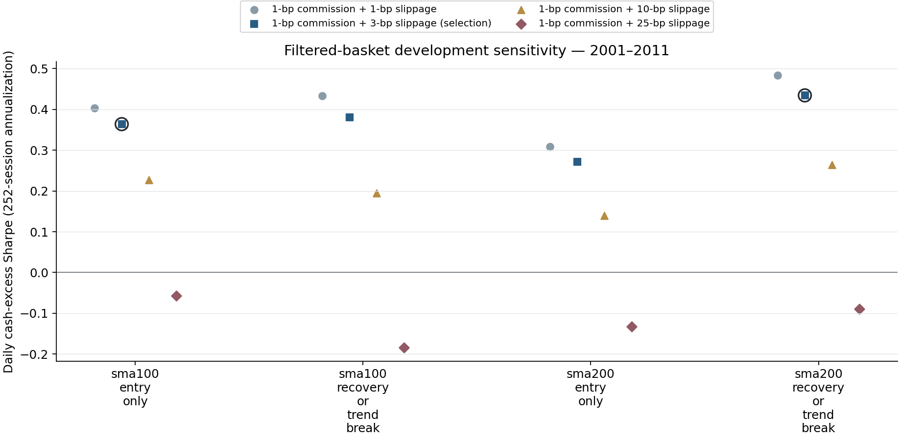
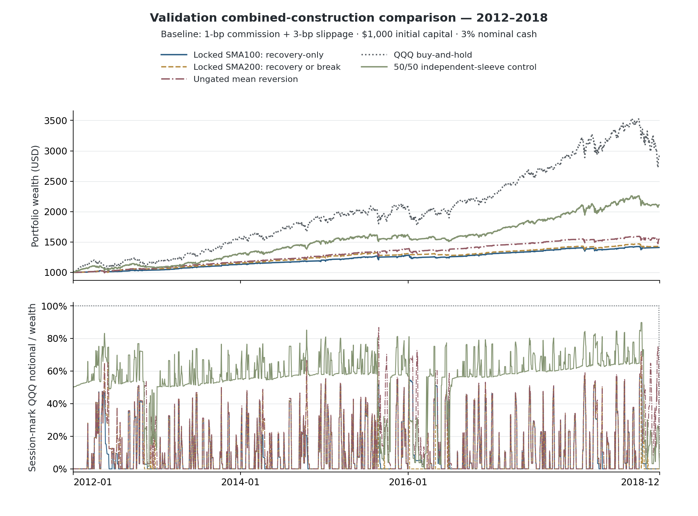
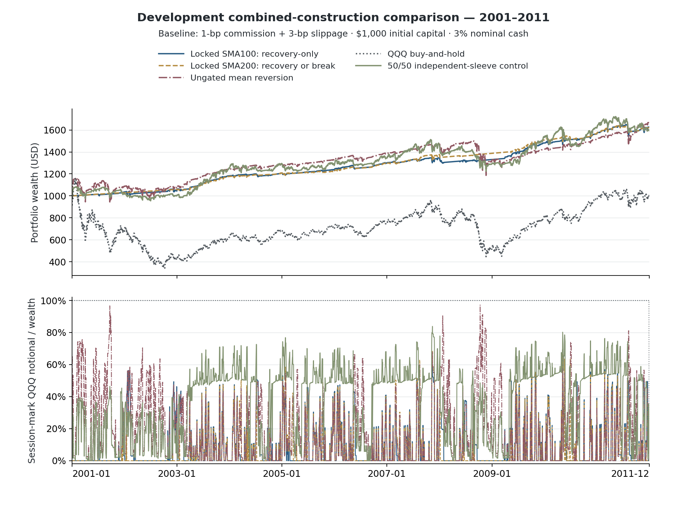

# Trend Following Study — Long-Term Trend + Short-Term Mean-Reversion Comparison

**Two constructions:** independently invested core/tactical sleeves versus trend-filtered pullback purchases. Filtered baskets use 32 equal initial MR sleeves; a trend gate supplies permission, not an invested trend sleeve.

**Retrospective, hindsight-conditioned research:** the 12 trend members were chosen using 2012–2018 performance. Development fitting does not restore independent validation. **2019 onward remains closed.**

## Development selections — 2001–2011

The two frozen exit-policy selections are `multi_scale_sma100_entry_only` and `multi_scale_sma200_recovery_or_trend_break`. For each policy, choose SMA100 or SMA200 using baseline daily cash-excess Sharpe. Undefined scores are excluded; ties within 1e-10 use stable basket ID. No growth, drawdown or trade-frequency filter applies.

| Portfolio | Sharpe | CAGR | Daily drawdown loss | Exposure | Gross sleeve orders/year | Notional turnover/year |
|---|---:|---:|---:|---:|---:|---:|
| multi_scale_sma100_entry_only | 0.3635 | 4.52% | 6.45% | 7.92% | 243.1325 | 8.4039 |
| multi_scale_sma200_entry_only | 0.2709 | 4.12% | 6.83% | 8.31% | 249.8610 | 8.2648 |
| multi_scale_sma100_recovery_or_trend_break | 0.3797 | 4.24% | 3.35% | 5.31% | 244.0418 | 8.2832 |
| multi_scale_sma200_recovery_or_trend_break | 0.4340 | 4.49% | 3.51% | 6.11% | 254.2253 | 8.5490 |



Rings mark the two baseline selections. Every hypothetical cost scenario evaluates unchanged rules; it does not select a new filter.

The independently invested sleeve experiment is reused from its existing seals: all 12 development allocations, and only the deduplicated locked/pure-style/50-50/equal-44 validation controls. Its old selected allocation is never replaced.

## Retrospective validation — 2012–2018

All four filtered baskets were predefined. Two are locked policy selections; the others are controls, not replacement winners.

| Portfolio | Sharpe | CAGR | Daily drawdown loss | Exposure | Gross sleeve orders/year | Notional turnover/year |
|---|---:|---:|---:|---:|---:|---:|
| multi_scale_sma100_entry_only | 0.4962 | 5.03% | 4.90% | 9.36% | 312.9413 | 10.8042 |
| multi_scale_sma200_entry_only | 0.5675 | 5.76% | 6.26% | 11.40% | 353.2379 | 12.3884 |
| multi_scale_sma100_recovery_or_trend_break | 0.1535 | 3.46% | 6.00% | 6.99% | 315.7993 | 10.5607 |
| multi_scale_sma200_recovery_or_trend_break | 0.5680 | 5.22% | 4.34% | 9.43% | 354.0953 | 12.2258 |

### Independent sleeves, gate-only controls, QQQ and cash

| Portfolio | Sharpe | CAGR | Daily drawdown loss | Exposure | Gross sleeve orders/year | Notional turnover/year |
|---|---:|---:|---:|---:|---:|---:|
| portfolio_tf_000 | 0.5992 | 6.46% | 7.55% | 12.93% | 391.8197 | 13.7625 |
| portfolio_tf_100 | 0.8979 | 15.08% | 13.70% | 88.90% | 41.1539 | 3.4276 |
| portfolio_tf_050 | 0.8994 | 11.27% | 8.29% | 55.97% | 432.9736 | 7.8264 |
| portfolio_equal_44 | 0.8631 | 9.24% | 7.97% | 38.01% | 432.9736 | 10.2771 |
| buy_and_hold | 0.8562 | 16.59% | 22.79% | 100.00% | — | 0.2857 |
| cash | — | 3.05% | 0.00% | 0.00% | — | 0.0000 |
| multi_scale_sma100_only | 0.4554 | 8.10% | 16.88% | 81.55% | 11.1459 | 11.1436 |
| multi_scale_sma200_only | 0.6805 | 12.04% | 21.54% | 90.28% | 5.1442 | 5.1432 |



The exposure chart uses daily provider marks; summary exposure is the elapsed-calendar-time integral on the full event clock. Neither exposure series is an average of fixed sleeve binary position flags.

### Locked baskets under execution stresses

| Portfolio | Slippage + 1-bp commission | Sharpe | CAGR | Daily drawdown loss | Exposure | Gross sleeve orders/year | Notional turnover/year |
|---|---:|---:|---:|---:|---:|---:|---:|
| multi_scale_sma100_entry_only | 1 + 1 bp | 0.5477 | 5.26% | 4.94% | 9.45% | 312.9413 | 10.9171 |
| multi_scale_sma200_recovery_or_trend_break | 1 + 1 bp | 0.6274 | 5.49% | 4.34% | 9.52% | 354.0953 | 12.3592 |
| multi_scale_sma100_entry_only | 3 + 1 bp | 0.4962 | 5.03% | 4.90% | 9.36% | 312.9413 | 10.8042 |
| multi_scale_sma200_recovery_or_trend_break | 3 + 1 bp | 0.5680 | 5.22% | 4.34% | 9.43% | 354.0953 | 12.2258 |
| multi_scale_sma100_entry_only | 10 + 1 bp | 0.3158 | 4.23% | 4.79% | 9.06% | 312.9413 | 10.4175 |
| multi_scale_sma200_recovery_or_trend_break | 10 + 1 bp | 0.3602 | 4.35% | 4.34% | 9.10% | 354.0953 | 11.7698 |
| multi_scale_sma100_entry_only | 25 + 1 bp | -0.0702 | 2.72% | 4.55% | 8.44% | 312.9413 | 9.6349 |
| multi_scale_sma200_recovery_or_trend_break | 25 + 1 bp | -0.0823 | 2.70% | 4.79% | 8.44% | 354.0953 | 10.8520 |

See [paired bootstrap intervals](validation_bootstrap.csv): each locked filtered basket versus the old locked sleeve portfolio, ungated MR and QQQ; identical comparison paths are deduplicated with aliases retained. Two thousand paired circular moving-block resamples use 5/20/60-session blocks, seed 20261009 and 95% percentile intervals. Intervals describe fixed historical portfolios and **do not correct selection bias**.

## Reviewed results interpretation

At baseline costs (**1-bp commission + 3-bps slippage**), neither development-locked filtered basket beat the ungated MR basket or QQQ buy-and-hold on **validation Sharpe or CAGR**:

- **SMA100 entry-only gate:** Sharpe **0.4962**, CAGR **5.03%**, daily drawdown loss **4.90%**, average actual QQQ exposure **9.36%**.
- **SMA200 recovery-or-trend-break gate:** Sharpe **0.5680**, CAGR **5.22%**, daily drawdown loss **4.34%**, exposure **9.43%**.
- **Ungated MR / existing locked independent allocation:** Sharpe **0.5992**, CAGR **6.46%**, drawdown loss **7.55%**, exposure **12.93%**. The original independent allocation remains **0% trend / 100% MR**; it is not replaced after validation.
- **QQQ buy-and-hold:** Sharpe **0.8562**, CAGR **16.59%**, drawdown loss **22.79%**.

The gates reduced measured drawdown and QQQ exposure, but also reduced growth and did **not** improve the validation after-cost Sharpe objective versus ungated MR. This is a tradeoff in these fixed historical tests, not evidence that the new rule works prospectively. Under 25-bp slippage plus 1-bp commission, both locked filtered baskets had **negative cash-excess Sharpe** (−0.0702 and −0.0823).

The independent **50/50 initial-capital control** reached Sharpe **0.8994** and CAGR **11.27%** at baseline costs: a modest Sharpe advantage over BH, with materially lower growth. It is a **predefined control, not the development-selected allocation**. Its Sharpe advantage over cost-matched BH disappeared at 10- and 25-bp slippage. No allocation or filter was reselected from validation outcomes.

**All 12 paired-bootstrap 95% percentile intervals include zero.** The locked independent allocation and ungated MR have identical return paths and therefore share one reference with both aliases. These intervals do not correct the earlier candidate-membership selection bias, and they do not prove equality or a causal risk reduction.

## Exact trading and accounting definitions

- The SMA100/SMA200 gate uses finalized daily causal signal-index values only. ON means value > SMA including that final observation; equality is OFF. Missing/insufficient required history is UNKNOWN. Gate publication is assumed at 17:00 New York; intraday checks never finalize it. Normal closures do not make data stale.
- Entry needs gate ON plus original oversold support for seven consecutive completed half-hour checks (3 trading hours). Recovery-only exits keep the original MR recovery condition. Trend-break exits use a separate seven-check OFF counter; alternating recovery and trend-break observations never form one mixed streak. Either completed exit streak can trigger a sell.
- Fill at the next safe observed open. An OFF gate cancels unfilled entry; an ON gate cancels unfilled trend-break-only exit but preserves a confirmed recovery exit. UNKNOWN/stale gates and missing intervals hold the last filled position, cancel orders and reset streaks. Gate-driven entry/exit cancellations, blackout cancellations and terminal pending-order cancellations are reported separately: terminal cleanup is not a risk-management trade. Post-gap flags remain descriptive only. Gate-only controls use seven ON/OFF checks without an MR trigger.
- Start each scored segment at $1,000 cash with positions/orders/counters reset. Equal capital remains in each original sleeve; weights drift. Aggregate wealth and recompute returns, not average Sharpes or fixed weighted daily returns. No rebalancing or netting savings.
- Cash accrues 3% nominal ACT/365 on the frozen event clock; this is not exactly 3% APY. Preserve splits, dividends/DRIP and terminal liquidation. QQQ/cash only; no leverage, shorting, taxes, financing or separate fund expenses.
- Sharpe uses daily cash-excess returns with sqrt(252) and sample SD. CAGR uses actual elapsed calendar years. Drawdown is daily at the assumed 17:00 provider mark, not intraday drawdown. Alpha-only execution prices are reconstructed as-traded values, not guaranteed native raw/point-in-time captures; provider marks need not be executable official closes.
- Exposure is actual QQQ notional / portfolio wealth on the event-left state, time weighted over calendar seconds. Notional turnover uses scaled gross order notional over common wealth before a simultaneous fill group. Gross sleeve orders, distinct execution timestamps and standalone holding durations are separate diagnostics—not net portfolio round trips.
- Cost drag compares zero-cost shadow wealth following the same recorded decisions to net wealth. Full-period 1/3/10/25-bp slippage plus 1-bp commission are hypothetical research stresses, not reconstructed historical execution regimes.

## Horizon and evidence caveats

Membership retains every existing daily parameter. All twelve trend exits use 200-day SMA/EMA; their entries include daily SMA/EMA 10/20/50/100 and MACD sets. The MR universe has 29 shorter-period members and three 50-day members listed below. This is therefore a comparison of a **new slow trend gate** with unchanged MR timing, not proof of strict horizon diversification. All strategies trade the same QQQ, so independent sleeves diversify timing rather than securities.

| MR family | Daily lookback | Entry threshold | Recovery threshold |
|---|---:|---:|---:|
| EMA_DISTANCE | 50 | −4% | +1% |
| ZSCORE | 50 | −2.5 standard deviations | 0 |
| ZSCORE | 50 | −2.5 standard deviations | +0.5 standard deviations |

Inspect [all 44 definitions](constituents.csv), [development portfolios](development_metrics.csv), [validation portfolios](validation_metrics.csv), [development constituent outcomes](development_constituents.csv), [validation constituent outcomes](validation_constituents.csv), [development controls](development_controls.csv), [validation controls](validation_controls.csv), [protocol summary](summary.json) and [artifact hashes](artifact_hashes.json). Annual returns are exported by stage; blocked oversold checks, confirmed trend-break exits, cancellations and holding duration remain inspectable in metric tables. Private prices, execution records, full freezes and receipts are excluded.

## Reproducing the display-only figure repair

The two wealth/exposure figures were re-rendered **after the performance freeze** to separate their headers/legends and improve date-label alignment. The frozen report generator, strategy engines, sealed results and plotted wealth/exposure coordinates were not changed. The development filter-selection figure was not re-rendered.

On the authorized local installation with its retained sealed derived arrays, run from the repository root:

```sh
python scripts/plot_multi_scale_report.py
```

This [display-only renderer](../../../scripts/plot_multi_scale_report.py) performs no backtest, signal evaluation, selection or price download. [Figure layout provenance](figure_layout_audit.json) records the unchanged input and plotted-array hashes and geometry checks. Private derived arrays are not included in Git; the public report remains inspectable through its exported outcome tables, hashes and audit receipts. Results interpretation and threshold-unit formatting above are reviewed report annotations, not changes to sealed outcomes.


