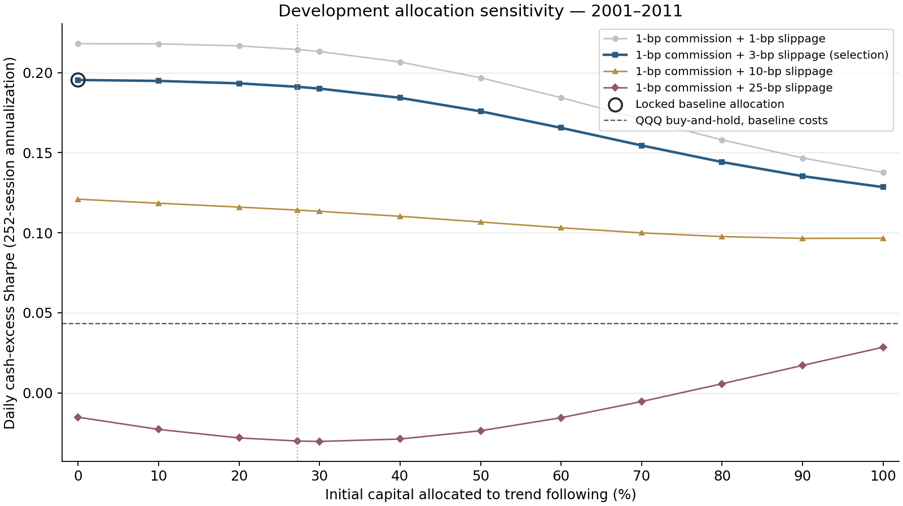

# QQQ Strategy Portfolio Study

**Fixed initial capital sleeves; 12 trend + 32 mean-reversion strategies; no rebalancing or order netting.**

Development locked **0% trend / 100% mean reversion** (`portfolio_tf_000`). Within each style, initial capital is equal across candidates. The same allocation is used at every validation cost scenario.
**A pure style won development: mixing did not improve the selected development Sharpe objective.**

**This experiment is hindsight-conditioned:** the twelve trend constituents were identified using 2012–2018 validation performance. Neither development fitting nor this retrospective validation restores independent confirmation. **2019 onward remains closed.**

## Main findings

- The baseline development optimum was **100% mean reversion**, with **0.1954 Sharpe, 4.76% CAGR and 20.93% daily drawdown loss**. Adding trend sleeves did not improve that development objective; the 10%-trend case was close at 0.1948 Sharpe.
- The locked mean-reversion allocation subsequently produced **0.5992 Sharpe, 6.46% CAGR and 7.55% daily drawdown loss** in validation, below QQQ's **0.8562 Sharpe and 16.59% CAGR**.
- The predefined **initial 50/50 control** produced **0.8994 Sharpe, 11.27% CAGR and 8.29% daily drawdown loss**. It had slightly higher Sharpe and lower drawdown than QQQ, but substantially lower growth. It was **not promoted or substituted for the locked allocation**.
- The 50/50 control's ending trend capital weight drifted to **63.30%**, versus its initial 50%; it was not periodically rebalanced. Equal-44's trend weight drifted from **27.27% to 39.27%**.
- Locked mean reversion generated **391.82 gross sleeve orders/year** at **130.61 distinct execution timestamps/year**. The 50/50 control generated **432.97 orders/year** at **136.47 distinct timestamps/year**; trend-only generated **41.15 orders/year** at **9.15 timestamps/year**. These measures are neither netted orders nor portfolio round trips.
- The 50/50 control's validation Sharpe advantage disappears under higher slippage: **0.8429 versus BH 0.8550** at 10 bps, and **0.7336 versus BH 0.8523** at 25 bps, each plus 1-bp commission. These are hypothetical execution stresses, not measured costs.
- All three block-length bootstrap intervals for the locked allocation's Sharpe difference versus QQQ and 50/50 include zero. They do not establish a reliable edge and do not correct hindsight membership selection. No replacement allocation or 2019+ evaluation was selected.

## Development allocation search — 2001–2011

Twelve predefined initial allocations: trend 0–100% in 10% steps, plus equal capital across all 44 candidates (27.27% trend). Selection maximizes daily cash-excess Sharpe after 1-bp commission + 3-bps slippage. Undefined scores are excluded; ties within 1e-10 favor the allocation closest to 50/50, then stable ID. No growth, drawdown or trade-count filter applies.

| Portfolio | Initial trend | Sharpe | CAGR | Daily drawdown loss | Gross sleeve orders/year | Notional turnover/year |
|---|---:|---:|---:|---:|---:|---:|
| portfolio_tf_000 | 0.00% | 0.1954 | 4.76% | 20.93% | 454.4415 | 13.4707 |
| portfolio_tf_010 | 10.00% | 0.1948 | 4.68% | 19.34% | 528.9997 | 12.7483 |
| portfolio_tf_020 | 20.00% | 0.1933 | 4.59% | 19.08% | 528.9997 | 12.0253 |
| portfolio_equal_44 | 27.27% | 0.1911 | 4.53% | 19.09% | 528.9997 | 11.4989 |
| portfolio_tf_030 | 30.00% | 0.1900 | 4.51% | 19.09% | 528.9997 | 11.3013 |
| portfolio_tf_040 | 40.00% | 0.1843 | 4.42% | 19.10% | 528.9997 | 10.5759 |
| portfolio_tf_050 | 50.00% | 0.1759 | 4.34% | 19.11% | 528.9997 | 9.8489 |
| portfolio_tf_060 | 60.00% | 0.1655 | 4.25% | 19.12% | 528.9997 | 9.1197 |
| portfolio_tf_070 | 70.00% | 0.1545 | 4.16% | 19.13% | 528.9997 | 8.3883 |
| portfolio_tf_080 | 80.00% | 0.1442 | 4.07% | 19.64% | 528.9997 | 7.6541 |
| portfolio_tf_090 | 90.00% | 0.1354 | 3.98% | 20.95% | 528.9997 | 6.9169 |
| portfolio_tf_100 | 100.00% | 0.1285 | 3.89% | 22.25% | 74.5582 | 6.1763 |

The chart connects only the tested allocations, not a continuous optimization frontier. Its dotted vertical reference marks equal-44; the ring marks the one baseline-selected allocation. Other cost scenarios do not reselect it.

## Retrospective validation — 2012–2018

Only the locked allocation and predefined pure-style, 50/50 and equal-44 controls are evaluated, with duplicate IDs removed. Buy-and-hold and cash have matching start, dividend, cash-reference and terminal conventions.

| Portfolio | Initial trend | Sharpe | CAGR | Daily drawdown loss | Gross sleeve orders/year | Notional turnover/year |
|---|---:|---:|---:|---:|---:|---:|
| portfolio_tf_000 | 0.00% | 0.5992 | 6.46% | 7.55% | 391.8197 | 13.7625 |
| portfolio_tf_100 | 100.00% | 0.8979 | 15.08% | 13.70% | 41.1539 | 3.4276 |
| portfolio_tf_050 | 50.00% | 0.8994 | 11.27% | 8.29% | 432.9736 | 7.8264 |
| portfolio_equal_44 | 27.27% | 0.8631 | 9.24% | 7.97% | 432.9736 | 10.2771 |

### Cost-matched QQQ and cash

| Portfolio | Initial trend | Sharpe | CAGR | Daily drawdown loss | Gross sleeve orders/year | Notional turnover/year |
|---|---:|---:|---:|---:|---:|---:|
| buy_and_hold | — | 0.8562 | 16.59% | 22.79% | — | 0.2857 |
| cash | — | — | 3.05% | 0.00% | — | 0.0000 |

### Locked allocation under hypothetical execution stresses

| Slippage + 1-bp commission | Portfolio | Initial trend | Sharpe | CAGR | Daily drawdown loss | Gross sleeve orders/year | Notional turnover/year |
|---:|---|---:|---:|---:|---:|---:|---:|
| 1 + 1 bp | portfolio_tf_000 | 0.00% | 0.6439 | 6.76% | 7.56% | 391.8197 | 13.9147 |
| 3 + 1 bp | portfolio_tf_000 | 0.00% | 0.5992 | 6.46% | 7.55% | 391.8197 | 13.7625 |
| 10 + 1 bp | portfolio_tf_000 | 0.00% | 0.4449 | 5.46% | 7.50% | 391.8197 | 13.2425 |
| 25 + 1 bp | portfolio_tf_000 | 0.00% | 0.1261 | 3.59% | 7.37% | 391.8197 | 12.1966 |

See [paired bootstrap intervals](validation_bootstrap.csv) for baseline validation Sharpe differences versus QQQ and 50/50. Two thousand paired circular moving-block resamples use 5/20/60-session blocks and seed 20261009. The intervals describe this fixed historical portfolio; they do not adjust for prior candidate selection or constitute untouched evidence.

## Accounting and metric definitions

- Each sleeve independently holds QQQ or cash using its unchanged daily indicators, shared three-hour/seven-check confirmations and next-safe-bar execution. Start every segment at $1,000 total, reset positions/counters, and use prior prices for indicator history only. Fractional shares and proportional costs permit exact sleeve scaling.
- Aggregate weighted **wealth**, then recompute daily returns; do not average constituent Sharpe or fixed-weight daily returns. Idle cash never moves between sleeves. Initial weights drift with relative sleeve performance. There are no extra portfolio-level trades.
- Charge gross sleeve commission/slippage once; assume no netting savings. Fixed 3% nominal ACT/365 cash accrues over the frozen event clock, including closures; effective growth is not exactly 3% APY. Splits, dividends/DRIP, blackouts and terminal liquidation match the frozen engines. No taxes, financing, leverage, shorts or separate fund expenses.
- Sharpe uses daily cash-excess returns, 252-session annualization and sample standard deviation. Drawdown uses daily provider marks at assumed 17:00 New York, not intraday lows. The Alpha-only execution quotes are reconstructed as-traded units, not guaranteed native raw/point-in-time captures.
- Gross sleeve order counts and distinct execution timestamps are separate measures; summed standalone round trips are **not** net portfolio round trips. Notional turnover uses scaled actual gross order notional divided by common portfolio wealth before the simultaneous fill group. No portfolio netting is assumed.
- Exposure is the elapsed-calendar-time average of actual QQQ notional divided by portfolio wealth, using the event-left state and latest available labelled quote between events. Carried marks serve valuation only, never fabricated signals or fills. It is not a fixed weighted average of standalone binary long-duration statistics; that separate diagnostic is also retained. Annual returns and terminal style weights are published with the other metrics.
- Constituent/style correlations use daily cash-excess returns. Constant cash-only series retain undefined correlations rather than being removed. Cost scenarios are full-period research assumptions, not measured historical QQQ execution costs or retrospectively labeled market regimes.

## Inspectable evidence

[Development metrics](development_metrics.csv) · [Validation metrics](validation_metrics.csv) · [Development benchmarks](development_benchmarks.csv) · [Validation benchmarks](validation_benchmarks.csv) · [Exact constituent membership](constituents.csv) · [Protocol summary](summary.json) · [Independent ledger/arithmetic audit](independent_audit.json) · [Artifact hashes](artifact_hashes.json)

[Development annual returns](development_annual_returns.csv) · [Validation annual returns](validation_annual_returns.csv) · [Development constituent correlations](development_correlations_constituent.csv) · [Validation constituent correlations](validation_correlations_constituent.csv) · [Development style correlations](development_correlations_style.csv) · [Validation style correlations](validation_correlations_style.csv). Raw prices, execution records, private authorization, full freezes and replay arrays stay private. Existing frozen trend and mean-reversion sources/results, monitors and resumes remain unchanged.
